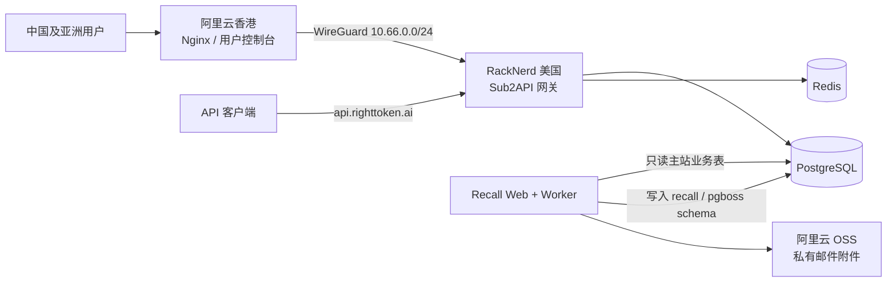

# RightToken

RightToken 是一个面向 AI 编程客户端和 OpenAI/Anthropic 兼容应用的 API 网关、计费平台与用户运营系统。本仓库基于 [Sub2API](https://github.com/Wei-Shaw/sub2api) 深度定制，包含主站、统一 API、支付、管理后台以及独立的用户召回管理台。

## 线上入口

| 服务 | 地址 | 说明 |
| --- | --- | --- |
| 用户控制台 | [righttoken.ai](https://righttoken.ai) | 注册、充值、余额、API Key 与使用记录 |
| API 网关 | [api.righttoken.ai](https://api.righttoken.ai) | OpenAI/Anthropic 兼容接口 |
| 联系邮箱 | [contact@righttoken.ai](mailto:contact@righttoken.ai) | 客服、支付及合规联系 |

管理入口不公开账号或凭据。生产密钥、数据库口令、邮箱密码、支付密钥和对象存储凭据均不得提交到 Git。

## 当前架构



- `righttoken.ai` 由香港节点承接页面访问，并通过 WireGuard 访问美国生产服务。
- `api.righttoken.ai` 直接连接美国 API 节点，避免模型请求绕行香港。
- PostgreSQL 和 Redis 不暴露到公网。
- 召回管理台只读主站用户、支付、用量和错误数据；运营数据写入独立的 `recall` 与 `pgboss` schema，不修改主站业务表。

## 主要能力

### API 网关

- OpenAI Responses API：`/v1/responses`
- OpenAI Chat Completions：`/v1/chat/completions`
- OpenAI 模型列表：`/v1/models`
- Anthropic Messages API：`/v1/messages`
- 流式与非流式响应、工具调用、模型映射、账号调度、失败重试和请求追踪
- API Key、分组权限、额度、倍率、缓存计费和使用明细
- 面向 Codex、Claude Code、WorkBuddy 等客户端的兼容配置

### 用户、计费与支付

- 邮箱注册、邀请与推荐奖励、余额和充值记录
- 管理员可查看用户、API Key、订单、消费、模型与端点统计
- 支付宝/EasyPay、Stripe（银行卡与微信支付）以及 Cryptomus USDT
- 多语言和本地化金额展示；内部计费与管理统计统一保留明确的币种口径
- 支付成功、失败、取消、退款和 Webhook 审计
- 对外提供服务条款、隐私政策、退款政策和可接受使用政策

### 用户召回管理台

- 用户全量/增量同步、A–G 自动分组、规则预览、版本、重算与回滚
- 国家/地区、语言、渠道和团队负载分配，支持人工负责人锁定
- 召回任务、优先级、运营驾驶舱、成员权限与审计记录
- SMTP/IMAP 邮件收取、回复匹配、模板、HTML 邮件、附件和人工归档
- 批量及定时邮件，按收件域名节流，避免集中投递
- 企业微信通知、失败重试和死信留痕
- 访问 UV/PV 与国家识别；支持 GeoLite2 City，也支持 RIR 国家级备用数据
- 邮件附件使用私有 S3 兼容对象存储，当前生产环境使用阿里云 OSS

召回管理台的完整说明见 [recall-admin/README.md](recall-admin/README.md)，生产部署与回滚见 [recall-admin/docs/deployment.md](recall-admin/docs/deployment.md)。

## 技术栈

| 模块 | 技术 |
| --- | --- |
| 网关后端 | Go、Gin、PostgreSQL、Redis |
| 主站前端 | Vue 3、TypeScript、Vite |
| 召回管理台 | Next.js、TypeScript、Prisma、PostgreSQL、pg-boss |
| 基础设施 | Docker、Nginx、WireGuard、Let's Encrypt |
| 外部存储 | S3 兼容对象存储（阿里云 OSS） |

## 仓库结构

```text
.
├── backend/          # Go API 网关、支付、计费和管理接口
├── frontend/         # RightToken 用户端与主管理后台
├── recall-admin/     # 用户召回管理台 Web、Worker、Prisma 与测试
├── deploy/           # Docker Compose、环境变量示例和部署文档
├── docs/             # 支付、接口和运维专题文档
└── Dockerfile        # 主站生产镜像
```

## 本地开发

### 主站

环境要求：Go `1.26.5`、Node.js、PostgreSQL 和 Redis。最省事的方式是使用 Docker Compose：

```bash
cd deploy
cp .env.example .env
docker compose up -d
```

主站默认地址为 `http://127.0.0.1:8080`，健康检查：

```bash
curl http://127.0.0.1:8080/health
```

分别开发前后端时：

```bash
cd backend && go test ./...
cd frontend && npm ci && npm run dev
```

### 召回管理台

需要 Docker Desktop。以下命令会启动 PostgreSQL、执行迁移并启动 Web 与 Worker：

```bash
cd recall-admin
docker compose --env-file .env.example up --build -d
```

默认打开 `http://127.0.0.1:3000/dashboard`。不用 Docker 时请参照 [recall-admin/README.md](recall-admin/README.md)。

## 构建镜像

使用不可变提交号或发布号作为标签，不要只依赖 `latest`：

```bash
docker build --platform linux/amd64 -t thatwy4/sub2api:<tag> .
docker build --platform linux/amd64 -f recall-admin/Dockerfile -t thatwy4/righttoken-recall-admin:<tag> recall-admin
```

发布镜像：

```bash
docker push thatwy4/sub2api:<tag>
docker push thatwy4/righttoken-recall-admin:<tag>
```

## 部署约定

| 环境 | 主服务 | 召回管理台 | 用途 |
| --- | --- | --- | --- |
| UAT | 阿里云香港 `sub2api-test` | `recall-uat-web` / `recall-uat-worker` | 迁移、功能和兼容性验证 |
| PROD | RackNerd 美国 `sub2api` | `recall-prod-web` / `recall-prod-worker` | 真实用户与生产流量 |

每次发布遵循以下顺序：

1. 使用明确的 Git 提交标签构建并推送镜像。
2. 先备份 PostgreSQL、配置文件和当前镜像信息。
3. 在 UAT 执行数据库迁移，更新 Web/Worker/主站并验证健康检查。
4. UAT 验证通过后再更新 PROD。
5. 检查容器健康、公开健康端点和最近错误日志。
6. 保留上一镜像标签和数据库备份用于回滚。

详细主站部署流程见 [deploy/DEPLOY-SOP.md](deploy/DEPLOY-SOP.md)。部署文件说明见 [deploy/README.md](deploy/README.md)。

## 生产配置原则

- 生产配置放在服务器权限为 `600` 的环境文件中，不写入仓库。
- `SESSION_COOKIE_SECRET`、`APP_ENCRYPTION_KEY`、`VISITOR_HASH_KEY` 等必须使用独立强随机值。
- 召回管理台正式环境使用 `AUTH_MODE=righttoken`，由 RightToken 主站统一登录。
- 邮件附件必须使用私有 S3 兼容存储；禁止生产环境使用容器本地临时目录。
- GeoIP 数据目录以只读方式挂载。RIR 数据只能识别国家，省/州级识别需要 GeoLite2 City 或合规的 GeoIP 服务。
- Nginx 与应用必须正确配置受信代理，确保审计和访问分析获得真实客户端 IP。
- PostgreSQL、Redis、管理台内部端口和 WireGuard 端口只开放给必要来源。

环境变量模板：

- 主站：[deploy/.env.example](deploy/.env.example)
- 召回管理台：[recall-admin/.env.example](recall-admin/.env.example)
- 组合部署：[deploy/recall.env.example](deploy/recall.env.example)

## 验证

主站：

```bash
cd backend && go test ./...
cd frontend && npm run typecheck && npm run test:run && npm run build
```

召回管理台：

```bash
cd recall-admin
npm test
npm run test:integration
npm run typecheck
npm run lint
npm run worker:build
npm run bootstrap:build
npm run build
```

## 相关文档

- [支付系统（中文）](docs/PAYMENT_CN.md)
- [Payment System](docs/PAYMENT.md)
- [主站部署 SOP](deploy/DEPLOY-SOP.md)
- [召回管理台说明](recall-admin/README.md)
- [召回管理台生产部署](recall-admin/docs/deployment.md)
- [数据库迁移说明](backend/migrations/README.md)

## 上游与许可证

本项目派生自 [Wei-Shaw/sub2api](https://github.com/Wei-Shaw/sub2api)。上游项目与贡献者的版权归原作者所有；本仓库继续遵循根目录 [LICENSE](LICENSE) 中的许可证条款。
